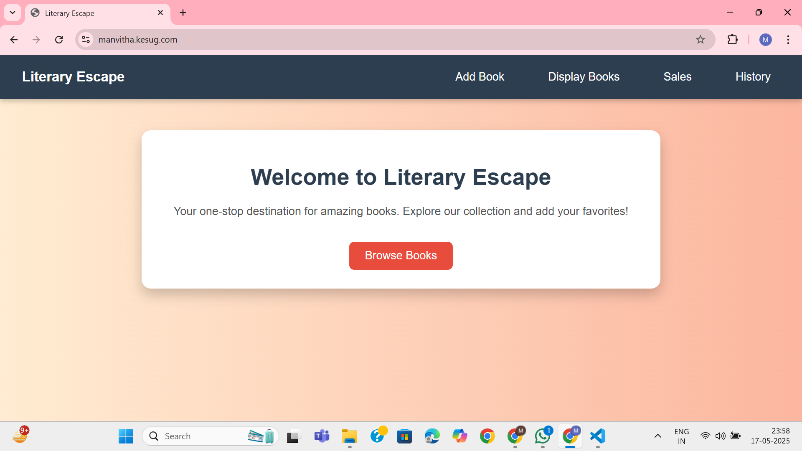
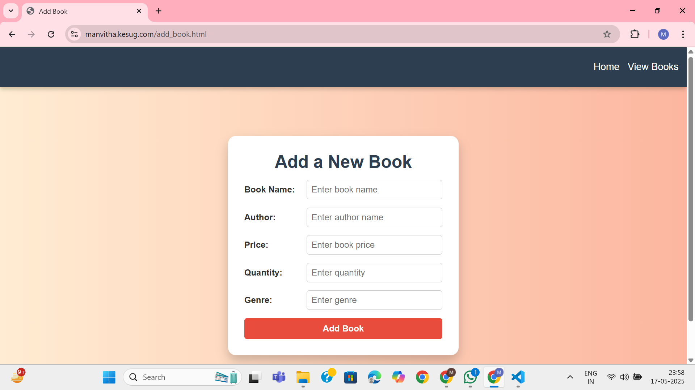
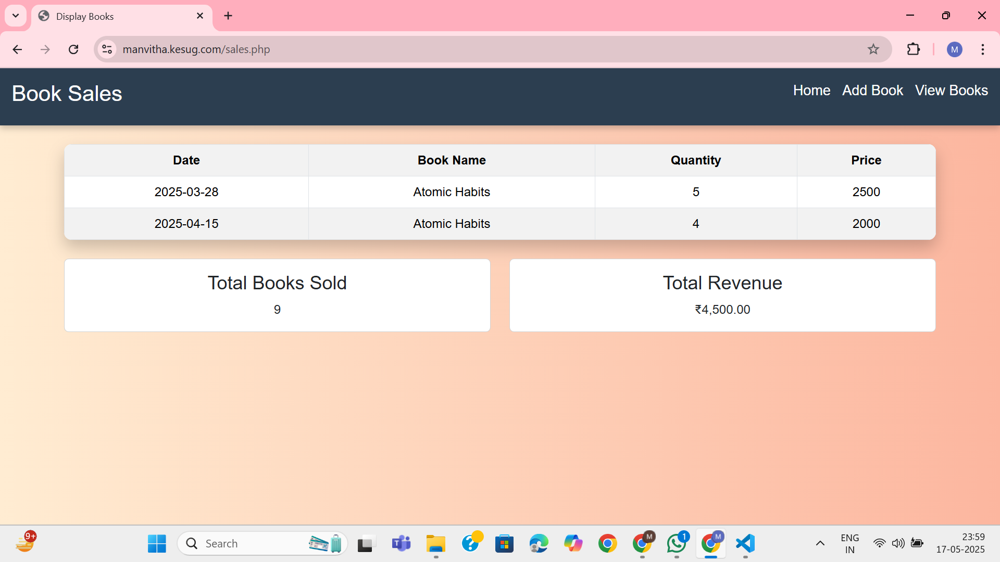
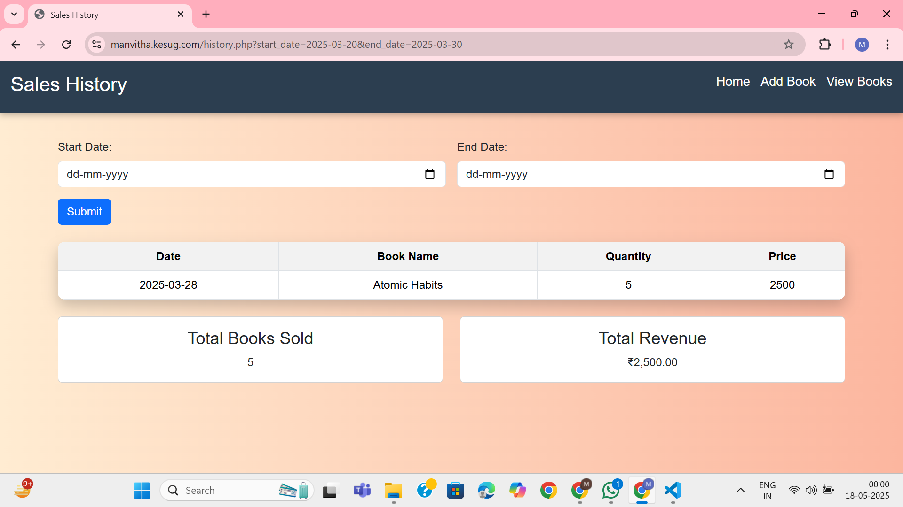

# 📚 Literary Escape

**Literary Escape** is a web-based platform designed for book enthusiasts to explore, purchase, and manage their favorite books. Built using PHP and HTML, this application offers a seamless experience for both users and administrators to interact with a digital bookstore.

---

## 📝 Introduction

In today's digital age, accessing and managing books online has become increasingly essential. Literary Escape aims to provide a user-friendly interface where users can browse through a collection of books, make purchases, and view their purchase history, all in one place.

---

## 📄 Abstract

Literary Escape is a dynamic web application that simulates an online bookstore. It allows users to:

- View a curated list of books.
- Purchase books and manage their orders.
- Administrators can add new books to the collection and monitor sales.

The application leverages PHP for server-side scripting and HTML for structuring the web pages, ensuring a responsive and interactive user experience.

---

## ✨ Features

- **Book Listing**: Displays a comprehensive list of available books.
- **Purchase Functionality**: Users can buy books and receive confirmations.
- **Admin Panel**: Administrators can add new books and view sales history.
- **User Purchase History**: Users can view their past purchases.
- **Responsive Design**: Ensures compatibility across various devices.

---

## 🖼️ Screenshots






---

## 🌐 Live Demo

Experience the application live at:  
👉 [http://manvitha.kesug.com/](http://manvitha.kesug.com/)

---

## 🛠️ Tech Stack

- **Frontend**: HTML, CSS
- **Backend**: PHP
- **Database**: MySQL (Assumed based on standard practices)
- **Version Control**: Git

---

## 🧠 Approach

1. **Frontend Development**: Designed intuitive HTML pages for user interaction.
2. **Backend Integration**: Implemented PHP scripts to handle form submissions, data processing, and database interactions.
3. **Database Management**: Structured a MySQL database to store book details, user information, and purchase records.
4. **Testing**: Conducted thorough testing to ensure all functionalities work seamlessly.

---

## ⬇️ Cloning the Repository

```bash
git clone https://github.com/ManvithaPola/Literary-Escape.git
cd Literary-Escape
```
## 🚀 Running the Application

### Set Up a Local Server:
- Install XAMPP or WAMP on your machine.
- Place the project folder inside the `htdocs` directory.

### Start the Server:
- Launch Apache and MySQL from the control panel.

### Database Configuration:
- Create a new MySQL database named `literary_escape`.
- Import the provided SQL file to set up the necessary tables.

### Access the Application:
- Navigate to `http://localhost/Literary-Escape/home.html` in your web browser.

---

## 🔮 Future Enhancements

- **User Authentication:** Implement login and registration functionalities.
- **Search Functionality:** Allow users to search for books by title, author, or genre.
- **Rating and Reviews:** Enable users to rate and review books.
- **Wishlist Feature:** Allow users to add books to a wishlist for future purchases.
- **Enhanced UI/UX:** Improve the design for a more engaging user experience.
